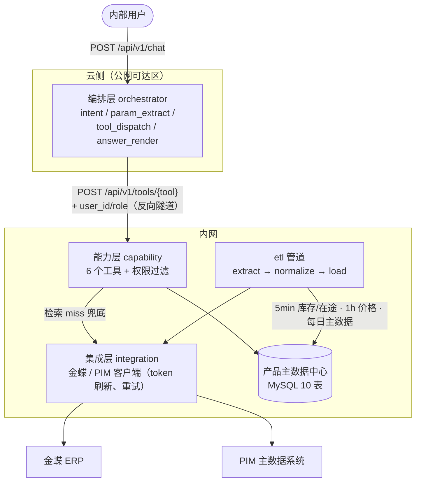
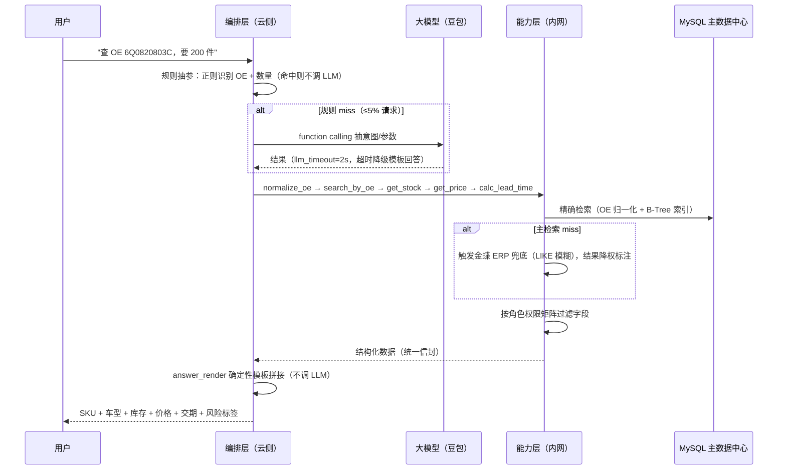

# 架构综述（v2）

> 面向读者的架构导读：系统怎么分层、数据怎么流、LLM 的边界画在哪里、哪些决策最关键。
> 权威定义以 [spec.md](spec.md) 与 [decisions/](decisions/) 为准。

## 1. 系统定位

内部业务智能体，夹在「人」和「系统」之间：服务业务员 / 跟单 / 仓库 / 售后客服四类角色，**不直接面对客户、不对外暴露**。M1 聚焦：OE 号 → SKU、车型 → SKU、交期计算（附库存与分级价）。

## 2. 五层架构 + 数据地基

代码侧为 src layout 单包 `qipei_agent`（ADR-42）：`src/qipei_agent/{orchestrator,capability,integration,etl,shared}`，`config/` 为部署期配置不入包，`tests/` 镜像 src 结构。

关键边界：

- **主路径不实时打金蝶/PIM**：检索全读 MySQL 主数据中心；金蝶/PIM 只在 ETL 触发，金蝶额外在「检索 miss 兜底」时触发（ADR-04）。
- **权限过滤在能力层（内网）**，不在编排层（云侧）——敏感字段根本不出内网（ADR-34）。
- **零写操作红线**：集成层只有 executeBillQuery 只读查询，agent 不提供任何写接口，交期采纳权 100% 在人（ADR-06）。
- **依赖注入**（ADR-41）：LLM / 网络 / 时钟 / 随机 / 文件 IO 一律构造函数或参数注入，默认值绑真实实现——这是测试可 mock 的前提。

## 3. 一次查询的旅程（LLM 边界）

LLM 的三条边界（ADR-13）：只做意图识别/参数抽取/工具选择；不接触价格/库存原文；允许出网的仅限低敏感参数（OE 号、车型），超时 2s 降级模板，P95≤3s 无条件成立（ADR-31）。

## 4. 领域规则引擎（核心难点）

- **OE 归一化流水线**（ADR-15 v3）：trim → 大写 → 去前缀（8 项前缀清单、长度降序、边界规则防 `OEM123` 误删）→ 去非字母数字 → 纯数字去前导零 → 全 0 无效。26 个真实样本固化（与业务方逐条核对）为回归测试。现状命中率约 70%，目标 ≥98%。
- **交期三分支**（ADR-17/27/37）：现货 1 天；现货不足→拆分（缺口走「在途→采购」）；在途多笔 PO 按到货日升序取最早；采购周期兜底 15 天 + 供应商交期。插单风险分级：非默认供应商→medium，超历史月最大供货量→high（ADR-36）。
- **分级价优先级**（ADR-26）：客户专属价 > 等级价 > 人工询价；阶梯 FQTYLOW~FQTYHIGH；含税口径统一；不换算币种。

## 5. 关键决策速查

| 决策 | 选择 | 放弃 | 一句话理由 |
|---|---|---|---|
| 检索技术（ADR-03） | 归一化 + 关系库精确索引 | RAG / 向量检索 | 结构化编码上语义相似无意义，黑盒不可控 |
| LLM 职责（ADR-13） | 只做意图/抽参/工具选择 | LLM 组织回答 | 敏感数据不出网 + 消除回答幻觉 |
| 权限落点（ADR-34） | 能力层（内网）过滤 | 编排层（云侧）过滤 | 敏感字段不出内网，泄密面最小 |
| 抽参策略（ADR-31） | 规则优先，LLM 兜底 ≤5% | 全 LLM 抽取 | 规则路径 <1s，P95 可控可解释 |
| 写操作（ADR-06） | 零写，采纳权在人 | 自动落库 | 交期牵动排单，防业务员插单 |
| 主数据源（ADR-04） | ETL 到 MySQL 主数据中心 | 实时查 ERP | ERP 并发与稳定性不可控 |
| 目录与构建（ADR-42） | src layout + hatchling | flat 布局 | 包边界清晰，config 不入包，发布可构建 |
| 可测性（ADR-41） | 外部依赖注入 | 内部直接实例化 | 可测性是设计出来的 |

## 6. 验收设计

| 指标 | 目标 | 口径 |
|---|---|---|
| OE 检索命中率 | ≥98% | 端到端，含 ERP 兜底后最终正确比例 |
| 规则命中率 | ≥95% | ≥200 条意图语料集，意图+参数全对（ADR-38） |
| 响应时间 | P95 ≤3s | 全量请求（含 LLM 与 ERP 兜底耗时） |
| 交互轮次 | 1 轮 | 允许澄清追问 |
| 行覆盖 | ≥80% | 能力层/集成层 |
| 红线 | 零自动落库 | 100% 由人确认 |

DoD（ADR-24 + ADR-39）：pytest 全绿 + ruff 无告警 + 审计留痕 + **可提交的 ci.yml**。
